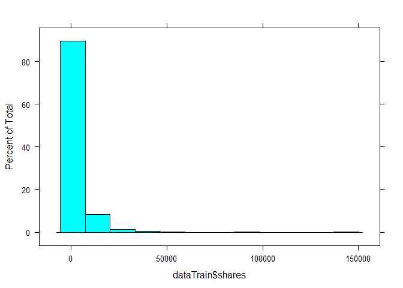
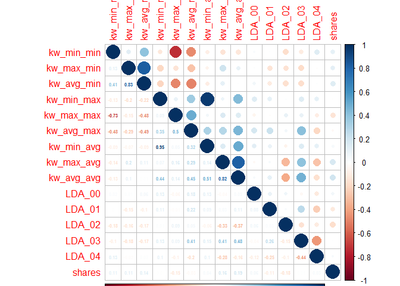
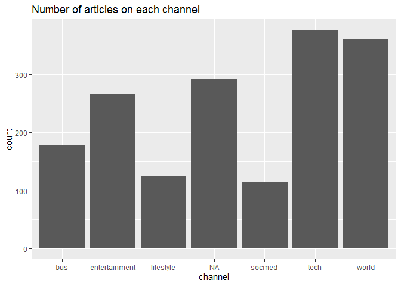
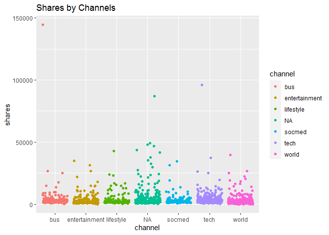
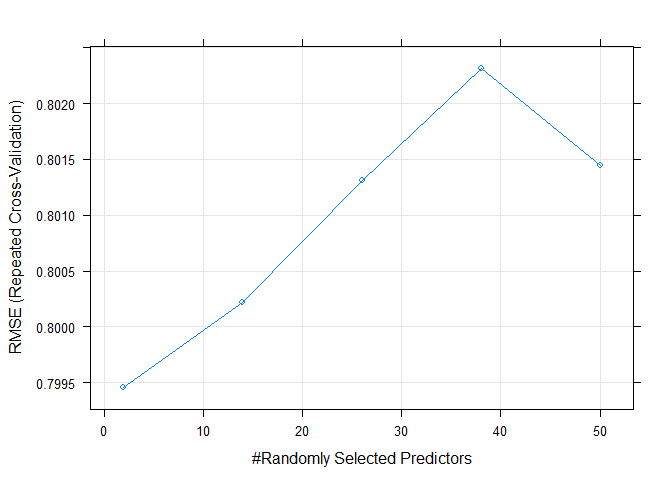
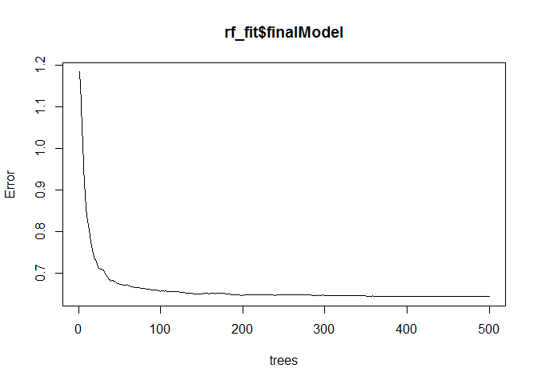

Project2
================
Kan Luo
6/27/2020

# SATURDAY ANALYSIS

## Introduction section

### Data background

Read in data set.

``` r
ONP_raw <-  read_csv("OnlineNewsPopularity.csv")
params$weekday
```

    ## [1] "saturday"

The data set [**Online News
Popularity**](https://archive.ics.uci.edu/ml/datasets/Online+News+Popularity)
inlcudes the features of articles published by
[Mashable](www.mashable.com) in two years. There are 39644 observations
and 61 variables in the dataset, without any missing values.

There are:

  - 2 non-predictive variable: url, timedelta  
  - 1 goal variable: shares  
  - 58 variables used to predict the goal variable.

Following are the attributes of all variables provided by the original
website:

`0. url: URL of the article (non-predictive)`  
`1. timedelta: Days between the article publication and the dataset
acquisition (non-predictive)`  
`2. n_tokens_title: Number of words in the title`  
`3. n_tokens_content: Number of words in the content`  
`4. n_unique_tokens: Rate of unique words in the content`  
`5. n_non_stop_words: Rate of non-stop words in the content`  
`6. n_non_stop_unique_tokens: Rate of unique non-stop words in the
content`  
`7. num_hrefs: Number of links`  
`8. num_self_hrefs: Number of links to other articles published by
Mashable`  
`9. num_imgs: Number of images`  
`10. num_videos: Number of videos`  
`11. average_token_length: Average length of the words in the content`  
`12. num_keywords: Number of keywords in the metadata`  
`13. data_channel_is_lifestyle: Is data channel 'Lifestyle'?`  
`14. data_channel_is_entertainment: Is data channel 'Entertainment'?`  
`15. data_channel_is_bus: Is data channel 'Business'?`  
`16. data_channel_is_socmed: Is data channel 'Social Media'?`  
`17. data_channel_is_tech: Is data channel 'Tech'?`  
`18. data_channel_is_world: Is data channel 'World'?`  
`19. kw_min_min: Worst keyword (min. shares)`  
`20. kw_max_min: Worst keyword (max. shares)`  
`21. kw_avg_min: Worst keyword (avg. shares)`  
`22. kw_min_max: Best keyword (min. shares)`  
`23. kw_max_max: Best keyword (max. shares)`  
`24. kw_avg_max: Best keyword (avg. shares)`  
`25. kw_min_avg: Avg. keyword (min. shares)`  
`26. kw_max_avg: Avg. keyword (max. shares)`  
`27. kw_avg_avg: Avg. keyword (avg. shares)`  
`28. self_reference_min_shares: Min. shares of referenced articles in
Mashable`  
`29. self_reference_max_shares: Max. shares of referenced articles in
Mashable`  
`30. self_reference_avg_sharess: Avg. shares of referenced articles in
Mashable`  
`31. weekday_is_monday: Was the article published on a Monday?`  
`32. weekday_is_tuesday: Was the article published on a Tuesday?`  
`33. weekday_is_wednesday: Was the article published on a Wednesday?`  
`34. weekday_is_thursday: Was the article published on a Thursday?`  
`35. weekday_is_friday: Was the article published on a Friday?`  
`36. weekday_is_saturday: Was the article published on a Saturday?`  
`37. weekday_is_sunday: Was the article published on a Sunday?`  
`38. is_weekend: Was the article published on the weekend?`  
`39. LDA_00: Closeness to LDA topic 0`  
`40. LDA_01: Closeness to LDA topic 1`  
`41. LDA_02: Closeness to LDA topic 2`  
`42. LDA_03: Closeness to LDA topic 3`  
`43. LDA_04: Closeness to LDA topic 4`  
`44. global_subjectivity: Text subjectivity`  
`45. global_sentiment_polarity: Text sentiment polarity`  
`46. global_rate_positive_words: Rate of positive words in the
content`  
`47. global_rate_negative_words: Rate of negative words in the
content`  
`48. rate_positive_words: Rate of positive words among non-neutral
tokens`  
`49. rate_negative_words: Rate of negative words among non-neutral
tokens`  
`50. avg_positive_polarity: Avg. polarity of positive words`  
`51. min_positive_polarity: Min. polarity of positive words`  
`52. max_positive_polarity: Max. polarity of positive words`  
`53. avg_negative_polarity: Avg. polarity of negative words`  
`54. min_negative_polarity: Min. polarity of negative words`  
`55. max_negative_polarity: Max. polarity of negative words`  
`56. title_subjectivity: Title subjectivity`  
`57. title_sentiment_polarity: Title polarity`  
`58. abs_title_subjectivity: Absolute subjectivity level`  
`59. abs_title_sentiment_polarity: Absolute polarity level`  
`60. shares: Number of shares (target)`

The details about the estimated relative performance values can be found
in the [article by K. Fernandes, P. Vinagre and P.
Cortez](https://www.researchgate.net/publication/283510525_A_Proactive_Intelligent_Decision_Support_System_for_Predicting_the_Popularity_of_Online_News).
The original contents can be found by the address in the `url` variable.

Data sources provided by:

  - Kelwin Fernandes (kafc @ inesctec.pt, kelwinfc @ gmail.com) - INESC
    TEC, Porto, Portugal/Universidade do Porto, Portugal.  
  - Pedro Vinagre (pedro.vinagre.sousa @ gmail.com) - ALGORITMI Research
    Centre, Universidade do Minho, Portugal  
  - Paulo Cortez - ALGORITMI Research Centre, Universidade do Minho,
    Portugal
  - Pedro Sernadela - Universidade de Aveiro

### Purpose of analysis

The goal is creating models to predict the `shares` variable from the
data set with any chosen weekdays (Monday, Tuesday, ect.).

### Methods to use

The method of prediction is using R to create two models based on
training data set:

  - Linear regression model: multiple linear regression.  
  - Non-linear model: random forests method.

After validating the two models on the training data set, will use the
model to predict the `shares` variable on test data set, and compare the
misclassification rate.

## Data

To generate analysis report for each weekday, I firstly grab the
sub-data set by weekday\_is\_\* variable, and discard two non-predictive
variables as well as weekday\_is\_\* variables. Based on the sub-data
set, create training data set (70%) and test data set (30%).

``` r
#Select Monday data, discard weekday_is_* variables.
data <- ONP_raw %>% filter( ONP_raw[paste0("weekday_is_", params$weekday)] == 1) %>% 
  select(-url, -timedelta, -weekday_is_monday, 
         -weekday_is_tuesday, -weekday_is_wednesday, -weekday_is_thursday, 
         -weekday_is_friday, -weekday_is_saturday, -weekday_is_sunday, -is_weekend)

#Set seed for reproducible.
set.seed(1)

#create train and test data sets. 
train <- sample(1:nrow(data), size = nrow(data)*0.7)

test <- dplyr::setdiff(1:nrow(data), train)

dataTrain <- data[train, ]

dataTest <- data[test, ]
```

This sub-data set contains 2453 observations and 51 variables.  
According to `Fernandes`’s article, for random tree method, `keyword`
based features are most important for predicting `shares`. It is make
sence that keywords can grab reader’s attention and interests quickly.
The natural language processing features (LDA topics) and previous
shares of Mashable linksare also very important. Some other features
such as words also have relative high ranking in RF model importance. I
will involve all the available predictive variables in both my linear
and non-linear models.

## Summarizations

Using `summary()` function, look at some basic statistic information on
each variabl, get an idea about min, max, mean, 1st/2nd/3rd quantiles.

``` r
summary(dataTrain)
```

    ##  n_tokens_title  n_tokens_content n_unique_tokens  n_non_stop_words
    ##  Min.   : 5.00   Min.   :   0.0   Min.   :0.0000   Min.   :0.000   
    ##  1st Qu.: 9.00   1st Qu.: 277.0   1st Qu.:0.4595   1st Qu.:1.000   
    ##  Median :10.00   Median : 496.0   Median :0.5199   Median :1.000   
    ##  Mean   :10.24   Mean   : 596.8   Mean   :0.5112   Mean   :0.961   
    ##  3rd Qu.:12.00   3rd Qu.: 781.0   3rd Qu.:0.5927   3rd Qu.:1.000   
    ##  Max.   :18.00   Max.   :4046.0   Max.   :0.9574   Max.   :1.000   
    ##  n_non_stop_unique_tokens   num_hrefs      num_self_hrefs  
    ##  Min.   :0.0000           Min.   :  0.00   Min.   : 0.000  
    ##  1st Qu.:0.6116           1st Qu.:  5.00   1st Qu.: 1.000  
    ##  Median :0.6742           Median : 10.00   Median : 3.000  
    ##  Mean   :0.6530           Mean   : 13.03   Mean   : 3.917  
    ##  3rd Qu.:0.7361           3rd Qu.: 17.00   3rd Qu.: 4.000  
    ##  Max.   :1.0000           Max.   :105.00   Max.   :74.000  
    ##     num_imgs        num_videos     average_token_length  num_keywords   
    ##  Min.   : 0.000   Min.   : 0.000   Min.   :0.000        Min.   : 1.000  
    ##  1st Qu.: 1.000   1st Qu.: 0.000   1st Qu.:4.475        1st Qu.: 6.000  
    ##  Median : 1.000   Median : 0.000   Median :4.666        Median : 8.000  
    ##  Mean   : 5.411   Mean   : 1.161   Mean   :4.507        Mean   : 7.547  
    ##  3rd Qu.: 8.000   3rd Qu.: 1.000   3rd Qu.:4.855        3rd Qu.: 9.000  
    ##  Max.   :99.000   Max.   :74.000   Max.   :6.295        Max.   :10.000  
    ##  data_channel_is_lifestyle data_channel_is_entertainment
    ##  Min.   :0.0000            Min.   :0.0000               
    ##  1st Qu.:0.0000            1st Qu.:0.0000               
    ##  Median :0.0000            Median :0.0000               
    ##  Mean   :0.0728            Mean   :0.1555               
    ##  3rd Qu.:0.0000            3rd Qu.:0.0000               
    ##  Max.   :1.0000            Max.   :1.0000               
    ##  data_channel_is_bus data_channel_is_socmed data_channel_is_tech
    ##  Min.   :0.0000      Min.   :0.00000        Min.   :0.0000      
    ##  1st Qu.:0.0000      1st Qu.:0.00000        1st Qu.:0.0000      
    ##  Median :0.0000      Median :0.00000        Median :0.0000      
    ##  Mean   :0.1043      Mean   :0.06639        Mean   :0.2196      
    ##  3rd Qu.:0.0000      3rd Qu.:0.00000        3rd Qu.:0.0000      
    ##  Max.   :1.0000      Max.   :1.00000        Max.   :1.0000      
    ##  data_channel_is_world   kw_min_min       kw_max_min      kw_avg_min    
    ##  Min.   :0.0000        Min.   : -1.00   Min.   :    0   Min.   :  -1.0  
    ##  1st Qu.:0.0000        1st Qu.: -1.00   1st Qu.:  461   1st Qu.: 142.8  
    ##  Median :0.0000        Median : -1.00   Median :  695   Median : 244.1  
    ##  Mean   :0.2108        Mean   : 23.59   Mean   : 1096   Mean   : 302.4  
    ##  3rd Qu.:0.0000        3rd Qu.:  4.00   3rd Qu.: 1100   3rd Qu.: 362.9  
    ##  Max.   :1.0000        Max.   :217.00   Max.   :50100   Max.   :8549.3  
    ##    kw_min_max       kw_max_max       kw_avg_max       kw_min_avg  
    ##  Min.   :     0   Min.   : 37400   Min.   :  7178   Min.   :   0  
    ##  1st Qu.:     0   1st Qu.:843300   1st Qu.:170944   1st Qu.:   0  
    ##  Median :  1900   Median :843300   Median :239888   Median :1266  
    ##  Mean   : 15659   Mean   :761791   Mean   :250369   Mean   :1260  
    ##  3rd Qu.: 10800   3rd Qu.:843300   3rd Qu.:315360   3rd Qu.:2212  
    ##  Max.   :843300   Max.   :843300   Max.   :843300   Max.   :3594  
    ##    kw_max_avg       kw_avg_avg    self_reference_min_shares
    ##  Min.   :  2414   Min.   : 1115   Min.   :     0           
    ##  1st Qu.:  3578   1st Qu.: 2505   1st Qu.:   681           
    ##  Median :  4662   Median : 3045   Median :  1300           
    ##  Mean   :  5982   Mean   : 3300   Mean   :  3753           
    ##  3rd Qu.:  6620   3rd Qu.: 3839   3rd Qu.:  2700           
    ##  Max.   :237967   Max.   :36717   Max.   :663600           
    ##  self_reference_max_shares self_reference_avg_sharess     LDA_00       
    ##  Min.   :     0            Min.   :     0             Min.   :0.02000  
    ##  1st Qu.:  1100            1st Qu.:  1000             1st Qu.:0.02500  
    ##  Median :  2900            Median :  2350             Median :0.03333  
    ##  Mean   : 10867            Mean   :  6087             Mean   :0.16589  
    ##  3rd Qu.:  8200            3rd Qu.:  5200             3rd Qu.:0.19810  
    ##  Max.   :837700            Max.   :663600             Max.   :0.91998  
    ##      LDA_01            LDA_02            LDA_03            LDA_04       
    ##  Min.   :0.01819   Min.   :0.01832   Min.   :0.01821   Min.   :0.02000  
    ##  1st Qu.:0.02352   1st Qu.:0.02500   1st Qu.:0.02502   1st Qu.:0.02857  
    ##  Median :0.03333   Median :0.04000   Median :0.04000   Median :0.05000  
    ##  Mean   :0.13438   Mean   :0.21386   Mean   :0.22585   Mean   :0.26003  
    ##  3rd Qu.:0.13412   3rd Qu.:0.33416   3rd Qu.:0.38332   3rd Qu.:0.45662  
    ##  Max.   :0.91996   Max.   :0.92000   Max.   :0.91997   Max.   :0.91999  
    ##  global_subjectivity global_sentiment_polarity global_rate_positive_words
    ##  Min.   :0.0000      Min.   :-0.2146           Min.   :0.00000           
    ##  1st Qu.:0.4063      1st Qu.: 0.0584           1st Qu.:0.02825           
    ##  Median :0.4630      Median : 0.1229           Median :0.04040           
    ##  Mean   :0.4491      Mean   : 0.1238           Mean   :0.04063           
    ##  3rd Qu.:0.5179      3rd Qu.: 0.1893           3rd Qu.:0.05263           
    ##  Max.   :0.8125      Max.   : 0.6000           Max.   :0.13065           
    ##  global_rate_negative_words rate_positive_words rate_negative_words
    ##  Min.   :0.000000           Min.   :0.0000      Min.   :0.0000     
    ##  1st Qu.:0.009823           1st Qu.:0.6000      1st Qu.:0.1818     
    ##  Median :0.015625           Median :0.7143      Median :0.2742     
    ##  Mean   :0.016684           Mean   :0.6778      Mean   :0.2832     
    ##  3rd Qu.:0.021906           3rd Qu.:0.8000      3rd Qu.:0.3750     
    ##  Max.   :0.139831           Max.   :1.0000      Max.   :1.0000     
    ##  avg_positive_polarity min_positive_polarity max_positive_polarity
    ##  Min.   :0.0000        Min.   :0.00000       Min.   :0.0000       
    ##  1st Qu.:0.3126        1st Qu.:0.05000       1st Qu.:0.6000       
    ##  Median :0.3659        Median :0.10000       Median :0.8000       
    ##  Mean   :0.3567        Mean   :0.08906       Mean   :0.7775       
    ##  3rd Qu.:0.4167        3rd Qu.:0.10000       3rd Qu.:1.0000       
    ##  Max.   :1.0000        Max.   :1.00000       Max.   :1.0000       
    ##  avg_negative_polarity min_negative_polarity max_negative_polarity
    ##  Min.   :-1.0000       Min.   :-1.0000       Min.   :-1.0000      
    ##  1st Qu.:-0.3396       1st Qu.:-0.8000       1st Qu.:-0.1250      
    ##  Median :-0.2607       Median :-0.5000       Median :-0.1000      
    ##  Mean   :-0.2668       Mean   :-0.5518       Mean   :-0.1037      
    ##  3rd Qu.:-0.1988       3rd Qu.:-0.3889       3rd Qu.:-0.0500      
    ##  Max.   : 0.0000       Max.   : 0.0000       Max.   : 0.0000      
    ##  title_subjectivity title_sentiment_polarity abs_title_subjectivity
    ##  Min.   :0.0000     Min.   :-1.00000         Min.   :0.0000        
    ##  1st Qu.:0.0000     1st Qu.: 0.00000         1st Qu.:0.1250        
    ##  Median :0.2000     Median : 0.00000         Median :0.4500        
    ##  Mean   :0.2881     Mean   : 0.09693         Mean   :0.3276        
    ##  3rd Qu.:0.5000     3rd Qu.: 0.22500         3rd Qu.:0.5000        
    ##  Max.   :1.0000     Max.   : 1.00000         Max.   :0.5000        
    ##  abs_title_sentiment_polarity     shares      
    ##  Min.   :0.00000              Min.   :    49  
    ##  1st Qu.:0.00000              1st Qu.:  1400  
    ##  Median :0.03333              Median :  2000  
    ##  Mean   :0.16647              Mean   :  3806  
    ##  3rd Qu.:0.25000              3rd Qu.:  3700  
    ##  Max.   :1.00000              Max.   :144400

Notice shares variable has a very large range, plot it to check.

``` r
histogram(dataTrain$shares)
```

<!-- -->

It is right skewed. Use log to make it more normal distributed.

``` r
dataTrain <- dataTrain %>% mutate(log_shares = log(shares))
histogram(dataTrain$log_shares)
```

<!-- -->

The `log(shares)` is better normally distributed, will use it for model
fit and predict.

The following correlation plot shows the correlation among keywords
features, natural language processing features and shares. Blue color
indicates positive correlated, red color indicates negative correlated,
size of dots represents how strong are two variables correlated.

``` r
library(corrplot)
#Create the correlation sub data set.
data_cor <- dataTrain %>% select(kw_min_min, kw_max_min, kw_avg_min, 
                                 kw_min_max, kw_max_max, kw_avg_max, 
                                 kw_min_avg, kw_max_avg, kw_avg_avg, 
                                 LDA_00, LDA_01, LDA_02, LDA_03, LDA_04, 
                                 shares)
#calculate correlation and plot.
Correlation <- cor(data_cor, method = "spearman")
corrplot(Correlation, type = "upper", tl.pos = "lt")
corrplot(Correlation, type = "lower", method = "number", tl.pos = "n", add = TRUE, diag = FALSE, number.cex = 0.5)
```

<!-- -->

We can also take a look at the channel feature variables and the number
of shares by channel.

The count histogram plot of channels shows the number of articles
published by each channel on selected weekdays.

The point plot shows the shares number of articles under each channel.

``` r
#Create new variable channel, and make a sub data set contains channel info and shares.
channel_sub <- dataTrain %>% mutate( channel = ifelse(data_channel_is_lifestyle == 1, "lifestyle", 
                                                      ifelse(data_channel_is_entertainment ==1, "entertainment", 
                                                             ifelse(data_channel_is_bus ==1, "bus", 
                                                                    ifelse(data_channel_is_socmed ==1, "socmed", 
                                                                           ifelse(data_channel_is_tech ==1, "tech", 
                                                                                  ifelse(data_channel_is_world ==1, "world", "NA"))))))) %>% select(channel, shares)
#Make plot on counts of each channel numbers
g1 <- ggplot(channel_sub, aes(x = channel))
g1 + stat_count() + ggtitle("Number of articles on each channel")
```

<!-- -->

``` r
#Make plot on shares values by channels.
g2 <- ggplot(channel_sub, aes(x = channel, y=shares))
g2 + geom_point(aes(fill = channel, colour = channel),position = "jitter") + ggtitle("Shares by Channels")
```

<!-- -->

## Modeling

### Random Forests

Using random Forests method to do the non-linear fit, as this method has
best performance in the reference paper. Using `train()` function from
`caret` package, R will generate tuning parameters `mrty` and
automatically select the optimal model.

``` r
#Subset a smaller dataTrain dataset for fitting.
#common out when doing final run.
#dataTrain <- dataTrain[1:300,]

#remove the shares column, use log_shares to train and predict
dataTrain <- dataTrain %>% select(-shares)
#setup the control
trctrl <- trainControl(method = "repeatedcv", number = 3, repeats = 1)
#Fit a RF tree
rf_fit<- train(log_shares ~ ., data=dataTrain, 
                method = "rf", trControl = trctrl, 
                preProcess = c("center", "scale"), tuneLength=5)
#check the fit
rf_fit
```

    ## Random Forest 
    ## 
    ## 1717 samples
    ##   50 predictor
    ## 
    ## Pre-processing: centered (50), scaled (50) 
    ## Resampling: Cross-Validated (3 fold, repeated 1 times) 
    ## Summary of sample sizes: 1145, 1145, 1144 
    ## Resampling results across tuning parameters:
    ## 
    ##   mtry  RMSE       Rsquared   MAE      
    ##    2    0.7994620  0.1340900  0.5984775
    ##   14    0.8002186  0.1278023  0.5992105
    ##   26    0.8013088  0.1260306  0.6003910
    ##   38    0.8023096  0.1248575  0.6022497
    ##   50    0.8014477  0.1275426  0.6015757
    ## 
    ## RMSE was used to select the optimal model using the smallest value.
    ## The final value used for the model was mtry = 2.

``` r
#plot the fit
plot(rf_fit)
```

<!-- -->

``` r
#plot the model
plot(rf_fit$finalModel)
```

<!-- -->

``` r
#predict() using the titanicDataTest dataset
rf_pred <- predict(rf_fit, newdata = dataTest)
#Use exp to convert the log value back.
rf_pred_e <- exp(rf_pred)

#Use ifelse to convert shares variable into 0 ( < 1400) or 1 ( >=1400)
#Turn them into factor.
#Use confusionMatrix function to compare the accuracy.
rf_match <- confusionMatrix(as.factor(ifelse(rf_pred_e < 1400, 0, 1)), as.factor(ifelse(dataTest$shares < 1400, 0, 1)))
#Calculate miss rate
rf_miss <- unname(1-rf_match[[3]][1])
#Call miss rate
rf_miss
```

    ## [1] 0.25

### Linear regression model

Create following linear regression models to compare:

``` r
lin_fit1 <- lm(log_shares ~ ., data = dataTrain)
lin_fit2 <- lm(log_shares ~ kw_min_min + kw_max_min + kw_avg_min + 
                 kw_min_max + kw_max_max + kw_avg_max + kw_min_avg + 
                 kw_max_avg + kw_avg_avg, data = dataTrain)
lin_fit3 <- lm(log_shares ~ kw_min_min + kw_max_min + kw_avg_min + 
                 kw_min_max + kw_max_max + kw_avg_max + kw_min_avg + 
                 kw_max_avg + kw_avg_avg + LDA_00 + LDA_01 + LDA_02 + 
                 LDA_03 + LDA_04, data = dataTrain)
```

Use [Dr. Post’s](https://www4.stat.ncsu.edu/~post/) function for Adj R
Square, AIC, AICc, BIC comparsion.

``` r
compareFitStats <- function(fit1, fit2, fit3){
  require(MuMIn)
  fitStats <- data.frame(fitStat = c("Adj R Square", "AIC", "AICc", "BIC"), 
                         col1 = round(c(summary(fit1)$adj.r.squared, AIC(fit1), MuMIn::AICc(fit1), BIC(fit1)), 3), 
                         col2 = round(c(summary(fit2)$adj.r.squared, AIC(fit2), MuMIn::AICc(fit2), BIC(fit2)), 3), 
                         col3 = round(c(summary(fit3)$adj.r.squared, AIC(fit3), MuMIn::AICc(fit3), BIC(fit3)), 3))
  #put names on returned df
  calls <- as.list(match.call())
  calls[[1]] <- NULL
  names(fitStats)[2:4] <- unlist(calls)
  fitStats
}

compareFitStats(lin_fit1, lin_fit2, lin_fit3)
```

    ##        fitStat lin_fit1 lin_fit2 lin_fit3
    ## 1 Adj R Square    0.099    0.060    0.088
    ## 2          AIC 4207.317 4241.809 4194.218
    ## 3         AICc 4210.378 4241.964 4194.500
    ## 4          BIC 4479.734 4301.741 4275.943

This function can calculate the Adj R Square, AIC, AICc, BIC statistics
for each fit, and export a table to easy compare. Typically, we will
prefer the fits which has larger Adj R Square, and smaller AIC, AICc AND
BIC.

In general, lin\_fit1 has higher Adj R Square values, will choose
lin\_fit1 to do the prediction.

``` r
lin_pred <- predict(lin_fit1, newdata = dataTest)
lin_pred_e <- exp(lin_pred)
lin_match <- confusionMatrix(as.factor(ifelse(lin_pred_e < 1400, 0, 1)), as.factor(ifelse(dataTest$shares < 1400, 0, 1)))
#Calculate miss rate
lin_miss <- unname(1-lin_match[[3]][1])
#Call miss rate
lin_miss
```

    ## [1] 0.25

### Compare model

Put two miss-rates from two models together to compare.

``` r
table(rf_miss, lin_miss)
```

    ##        lin_miss
    ## rf_miss 0.25
    ##    0.25    1

The lower missaccuracy rate is 0.25. Random Forests and linear
regression models have very close missaccuracy rate if we made the
problem into a binary classification (shares \< 1400 and \>= 1400). But
in general, Random Forests took a much longer fitting time than linear
regression.
