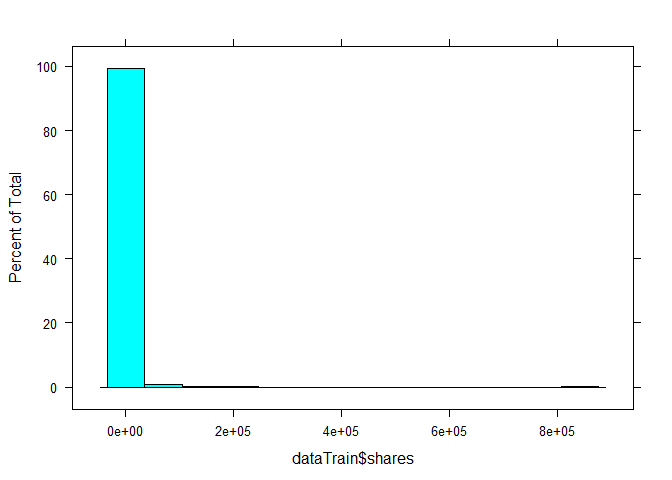
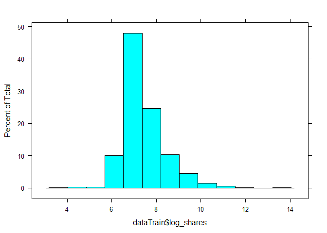
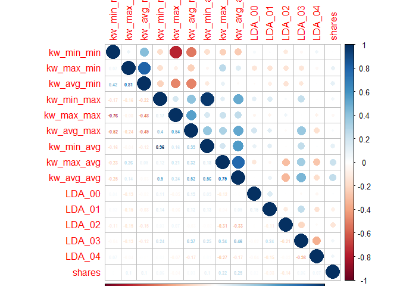
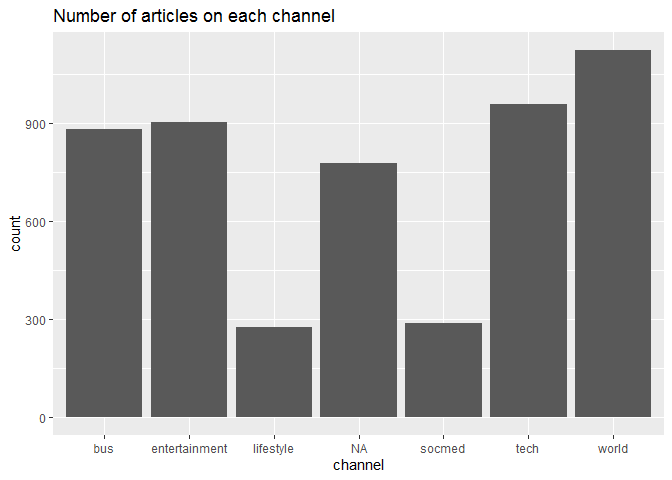
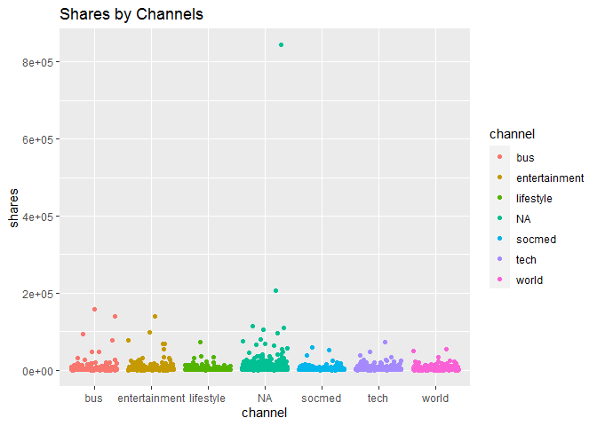
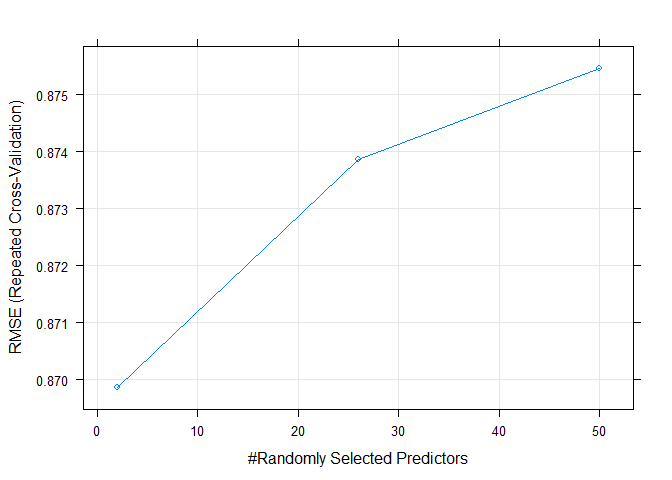
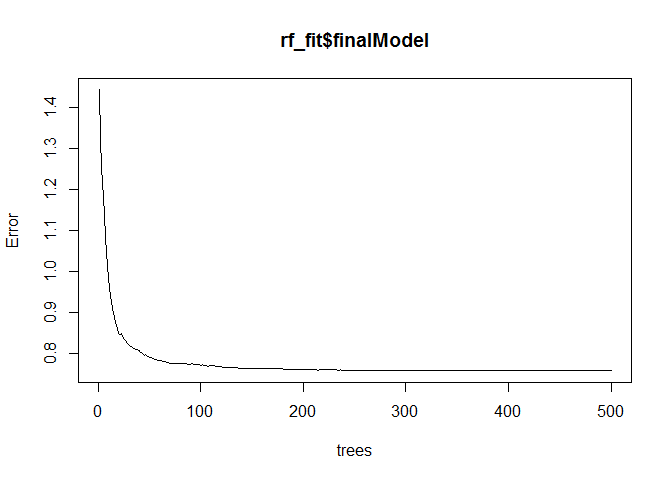

Project2
================
Kan Luo
6/27/2020

# WEDNESDAY ANALYSIS

## Introduction section

### Data background

Read in data set.

``` r
ONP_raw <-  read_csv("OnlineNewsPopularity.csv")
params$weekday
```

    ## [1] "wednesday"

The data set [**Online News
Popularity**](https://archive.ics.uci.edu/ml/datasets/Online+News+Popularity)
inlcudes the features of articles published by
[Mashable](www.mashable.com) in two years. There are 39644 observations
and 61 variables in the dataset, without any missing values.

There are:

  - 2 non-predictive variable: url, timedelta  
  - 1 goal variable: shares  
  - 58 variables used to predict the goal variable.

Following are the attributes of all variables provided by the original
website:

`0. url: URL of the article (non-predictive)`  
`1. timedelta: Days between the article publication and the dataset
acquisition (non-predictive)`  
`2. n_tokens_title: Number of words in the title`  
`3. n_tokens_content: Number of words in the content`  
`4. n_unique_tokens: Rate of unique words in the content`  
`5. n_non_stop_words: Rate of non-stop words in the content`  
`6. n_non_stop_unique_tokens: Rate of unique non-stop words in the
content`  
`7. num_hrefs: Number of links`  
`8. num_self_hrefs: Number of links to other articles published by
Mashable`  
`9. num_imgs: Number of images`  
`10. num_videos: Number of videos`  
`11. average_token_length: Average length of the words in the content`  
`12. num_keywords: Number of keywords in the metadata`  
`13. data_channel_is_lifestyle: Is data channel 'Lifestyle'?`  
`14. data_channel_is_entertainment: Is data channel 'Entertainment'?`  
`15. data_channel_is_bus: Is data channel 'Business'?`  
`16. data_channel_is_socmed: Is data channel 'Social Media'?`  
`17. data_channel_is_tech: Is data channel 'Tech'?`  
`18. data_channel_is_world: Is data channel 'World'?`  
`19. kw_min_min: Worst keyword (min. shares)`  
`20. kw_max_min: Worst keyword (max. shares)`  
`21. kw_avg_min: Worst keyword (avg. shares)`  
`22. kw_min_max: Best keyword (min. shares)`  
`23. kw_max_max: Best keyword (max. shares)`  
`24. kw_avg_max: Best keyword (avg. shares)`  
`25. kw_min_avg: Avg. keyword (min. shares)`  
`26. kw_max_avg: Avg. keyword (max. shares)`  
`27. kw_avg_avg: Avg. keyword (avg. shares)`  
`28. self_reference_min_shares: Min. shares of referenced articles in
Mashable`  
`29. self_reference_max_shares: Max. shares of referenced articles in
Mashable`  
`30. self_reference_avg_sharess: Avg. shares of referenced articles in
Mashable`  
`31. weekday_is_monday: Was the article published on a Monday?`  
`32. weekday_is_tuesday: Was the article published on a Tuesday?`  
`33. weekday_is_wednesday: Was the article published on a Wednesday?`  
`34. weekday_is_thursday: Was the article published on a Thursday?`  
`35. weekday_is_friday: Was the article published on a Friday?`  
`36. weekday_is_saturday: Was the article published on a Saturday?`  
`37. weekday_is_sunday: Was the article published on a Sunday?`  
`38. is_weekend: Was the article published on the weekend?`  
`39. LDA_00: Closeness to LDA topic 0`  
`40. LDA_01: Closeness to LDA topic 1`  
`41. LDA_02: Closeness to LDA topic 2`  
`42. LDA_03: Closeness to LDA topic 3`  
`43. LDA_04: Closeness to LDA topic 4`  
`44. global_subjectivity: Text subjectivity`  
`45. global_sentiment_polarity: Text sentiment polarity`  
`46. global_rate_positive_words: Rate of positive words in the
content`  
`47. global_rate_negative_words: Rate of negative words in the
content`  
`48. rate_positive_words: Rate of positive words among non-neutral
tokens`  
`49. rate_negative_words: Rate of negative words among non-neutral
tokens`  
`50. avg_positive_polarity: Avg. polarity of positive words`  
`51. min_positive_polarity: Min. polarity of positive words`  
`52. max_positive_polarity: Max. polarity of positive words`  
`53. avg_negative_polarity: Avg. polarity of negative words`  
`54. min_negative_polarity: Min. polarity of negative words`  
`55. max_negative_polarity: Max. polarity of negative words`  
`56. title_subjectivity: Title subjectivity`  
`57. title_sentiment_polarity: Title polarity`  
`58. abs_title_subjectivity: Absolute subjectivity level`  
`59. abs_title_sentiment_polarity: Absolute polarity level`  
`60. shares: Number of shares (target)`

The details about the estimated relative performance values can be found
in the [article by K. Fernandes, P. Vinagre and P.
Cortez](https://www.researchgate.net/publication/283510525_A_Proactive_Intelligent_Decision_Support_System_for_Predicting_the_Popularity_of_Online_News).
The original contents can be found by the address in the `url` variable.

Data sources provided by:

  - Kelwin Fernandes (kafc @ inesctec.pt, kelwinfc @ gmail.com) - INESC
    TEC, Porto, Portugal/Universidade do Porto, Portugal.  
  - Pedro Vinagre (pedro.vinagre.sousa @ gmail.com) - ALGORITMI Research
    Centre, Universidade do Minho, Portugal  
  - Paulo Cortez - ALGORITMI Research Centre, Universidade do Minho,
    Portugal
  - Pedro Sernadela - Universidade de Aveiro

### Purpose of analysis

The goal is creating models to predict the `shares` variable from the
data set with any chosen weekdays (Monday, Tuesday, ect.).

### Methods to use

The method of prediction is using R to create two models based on
training data set:

  - Linear regression model: multiple linear regression.  
  - Non-linear model: random forests method.

After validating the two models on the training data set, will use the
model to predict the `shares` variable on test data set, and compare the
misclassification rate.

## Data

To generate analysis report for each weekday, I firstly grab the
sub-data set by weekday\_is\_\* variable, and discard two non-predictive
variables as well as weekday\_is\_\* variables. Based on the sub-data
set, create training data set (70%) and test data set (30%).

``` r
#Select Monday data, discard weekday_is_* variables.
data <- ONP_raw %>% filter( ONP_raw[paste0("weekday_is_", params$weekday)] == 1) %>% 
  select(-url, -timedelta, -weekday_is_monday, 
         -weekday_is_tuesday, -weekday_is_wednesday, -weekday_is_thursday, 
         -weekday_is_friday, -weekday_is_saturday, -weekday_is_sunday, -is_weekend)

#Set seed for reproducible.
set.seed(1)

#create train and test data sets. 
train <- sample(1:nrow(data), size = nrow(data)*0.7)

test <- dplyr::setdiff(1:nrow(data), train)

dataTrain <- data[train, ]

dataTest <- data[test, ]
```

This sub-data set contains 7435 observations and 51 variables.  
According to `Fernandes`’s article, for random tree method, `keyword`
based features are most important for predicting `shares`. It is make
sence that keywords can grab reader’s attention and interests quickly.
The natural language processing features (LDA topics) and previous
shares of Mashable linksare also very important. Some other features
such as words also have relative high ranking in RF model importance. I
will involve all the available predictive variables in both my linear
and non-linear models.

## Summarizations

Using `summary()` function, look at some basic statistic information on
each variabl, get an idea about min, max, mean, 1st/2nd/3rd quantiles.

``` r
summary(dataTrain)
```

    ##  n_tokens_title  n_tokens_content n_unique_tokens  n_non_stop_words
    ##  Min.   : 4.00   Min.   :   0.0   Min.   :0.0000   Min.   :0.0000  
    ##  1st Qu.: 9.00   1st Qu.: 243.0   1st Qu.:0.4707   1st Qu.:1.0000  
    ##  Median :10.00   Median : 400.0   Median :0.5415   Median :1.0000  
    ##  Mean   :10.43   Mean   : 528.1   Mean   :0.5322   Mean   :0.9685  
    ##  3rd Qu.:12.00   3rd Qu.: 696.0   3rd Qu.:0.6126   3rd Qu.:1.0000  
    ##  Max.   :18.00   Max.   :4747.0   Max.   :0.9375   Max.   :1.0000  
    ##  n_non_stop_unique_tokens   num_hrefs      num_self_hrefs  
    ##  Min.   :0.0000           Min.   :  0.00   Min.   : 0.000  
    ##  1st Qu.:0.6277           1st Qu.:  4.00   1st Qu.: 1.000  
    ##  Median :0.6947           Median :  7.00   Median : 2.000  
    ##  Mean   :0.6752           Mean   : 10.18   Mean   : 3.113  
    ##  3rd Qu.:0.7583           3rd Qu.: 13.00   3rd Qu.: 4.000  
    ##  Max.   :1.0000           Max.   :150.00   Max.   :41.000  
    ##     num_imgs        num_videos     average_token_length  num_keywords   
    ##  Min.   : 0.000   Min.   : 0.000   Min.   :0.000        Min.   : 1.000  
    ##  1st Qu.: 1.000   1st Qu.: 0.000   1st Qu.:4.476        1st Qu.: 6.000  
    ##  Median : 1.000   Median : 0.000   Median :4.665        Median : 7.000  
    ##  Mean   : 4.074   Mean   : 1.254   Mean   :4.539        Mean   : 7.131  
    ##  3rd Qu.: 3.000   3rd Qu.: 1.000   3rd Qu.:4.853        3rd Qu.: 9.000  
    ##  Max.   :92.000   Max.   :73.000   Max.   :6.610        Max.   :10.000  
    ##  data_channel_is_lifestyle data_channel_is_entertainment
    ##  Min.   :0.00000           Min.   :0.0000               
    ##  1st Qu.:0.00000           1st Qu.:0.0000               
    ##  Median :0.00000           Median :0.0000               
    ##  Mean   :0.05265           Mean   :0.1733               
    ##  3rd Qu.:0.00000           3rd Qu.:0.0000               
    ##  Max.   :1.00000           Max.   :1.0000               
    ##  data_channel_is_bus data_channel_is_socmed data_channel_is_tech
    ##  Min.   :0.0000      Min.   :0.00000        Min.   :0.0000      
    ##  1st Qu.:0.0000      1st Qu.:0.00000        1st Qu.:0.0000      
    ##  Median :0.0000      Median :0.00000        Median :0.0000      
    ##  Mean   :0.1693      Mean   :0.05496        Mean   :0.1845      
    ##  3rd Qu.:0.0000      3rd Qu.:0.00000        3rd Qu.:0.0000      
    ##  Max.   :1.0000      Max.   :1.00000        Max.   :1.0000      
    ##  data_channel_is_world   kw_min_min       kw_max_min      
    ##  Min.   :0.0000        Min.   : -1.00   Min.   :     0.0  
    ##  1st Qu.:0.0000        1st Qu.: -1.00   1st Qu.:   444.0  
    ##  Median :0.0000        Median : -1.00   Median :   651.5  
    ##  Mean   :0.2158        Mean   : 27.51   Mean   :  1177.7  
    ##  3rd Qu.:0.0000        3rd Qu.:  4.00   3rd Qu.:  1000.0  
    ##  Max.   :1.0000        Max.   :294.00   Max.   :111300.0  
    ##    kw_avg_min        kw_min_max       kw_max_max       kw_avg_max    
    ##  Min.   :   -1.0   Min.   :     0   Min.   : 17100   Min.   :  2300  
    ##  1st Qu.:  138.6   1st Qu.:     0   1st Qu.:690400   1st Qu.:172978  
    ##  Median :  236.0   Median :  1400   Median :843300   Median :246243  
    ##  Mean   :  317.0   Mean   : 14825   Mean   :746551   Mean   :261913  
    ##  3rd Qu.:  358.5   3rd Qu.:  7700   3rd Qu.:843300   3rd Qu.:335659  
    ##  Max.   :18687.8   Max.   :843300   Max.   :843300   Max.   :843300  
    ##    kw_min_avg     kw_max_avg       kw_avg_avg     
    ##  Min.   :  -1   Min.   :  1953   Min.   :  424.3  
    ##  1st Qu.:   0   1st Qu.:  3521   1st Qu.: 2356.2  
    ##  Median :1009   Median :  4257   Median : 2832.3  
    ##  Mean   :1101   Mean   :  5613   Mean   : 3109.5  
    ##  3rd Qu.:2023   3rd Qu.:  5937   3rd Qu.: 3534.7  
    ##  Max.   :3613   Max.   :112787   Max.   :21000.7  
    ##  self_reference_min_shares self_reference_max_shares
    ##  Min.   :     0.0          Min.   :     0.0         
    ##  1st Qu.:   610.8          1st Qu.:   979.8         
    ##  Median :  1200.0          Median :  2700.0         
    ##  Mean   :  3895.5          Mean   : 10260.8         
    ##  3rd Qu.:  2700.0          3rd Qu.:  7825.0         
    ##  Max.   :690400.0          Max.   :837700.0         
    ##  self_reference_avg_sharess     LDA_00            LDA_01       
    ##  Min.   :     0.0           Min.   :0.01828   Min.   :0.01819  
    ##  1st Qu.:   922.8           1st Qu.:0.02512   1st Qu.:0.02504  
    ##  Median :  2150.0           Median :0.03348   Median :0.03335  
    ##  Mean   :  6407.1           Mean   :0.18844   Mean   :0.13753  
    ##  3rd Qu.:  5100.0           3rd Qu.:0.25223   3rd Qu.:0.14958  
    ##  Max.   :690400.0           Max.   :0.92000   Max.   :0.91998  
    ##      LDA_02            LDA_03            LDA_04        global_subjectivity
    ##  Min.   :0.01819   Min.   :0.01820   Min.   :0.01818   Min.   :0.0000     
    ##  1st Qu.:0.02857   1st Qu.:0.02857   1st Qu.:0.02858   1st Qu.:0.3945     
    ##  Median :0.04003   Median :0.04000   Median :0.05000   Median :0.4528     
    ##  Mean   :0.22033   Mean   :0.21979   Mean   :0.23392   Mean   :0.4413     
    ##  3rd Qu.:0.34746   3rd Qu.:0.36517   3rd Qu.:0.39822   3rd Qu.:0.5047     
    ##  Max.   :0.92000   Max.   :0.91998   Max.   :0.92712   Max.   :1.0000     
    ##  global_sentiment_polarity global_rate_positive_words
    ##  Min.   :-0.34167          Min.   :0.00000           
    ##  1st Qu.: 0.05762          1st Qu.:0.02789           
    ##  Median : 0.11956          Median :0.03854           
    ##  Mean   : 0.11826          Mean   :0.03924           
    ##  3rd Qu.: 0.17606          3rd Qu.:0.04973           
    ##  Max.   : 0.57374          Max.   :0.15549           
    ##  global_rate_negative_words rate_positive_words rate_negative_words
    ##  Min.   :0.000000           Min.   :0.0000      Min.   :0.0000     
    ##  1st Qu.:0.009479           1st Qu.:0.6000      1st Qu.:0.1818     
    ##  Median :0.014976           Median :0.7143      Median :0.2778     
    ##  Mean   :0.016270           Mean   :0.6828      Mean   :0.2857     
    ##  3rd Qu.:0.021408           3rd Qu.:0.8000      3rd Qu.:0.3846     
    ##  Max.   :0.085897           Max.   :1.0000      Max.   :1.0000     
    ##  avg_positive_polarity min_positive_polarity max_positive_polarity
    ##  Min.   :0.0000        Min.   :0.00000       Min.   :0.0000       
    ##  1st Qu.:0.3047        1st Qu.:0.05000       1st Qu.:0.6000       
    ##  Median :0.3575        Median :0.10000       Median :0.8000       
    ##  Mean   :0.3514        Mean   :0.09571       Mean   :0.7477       
    ##  3rd Qu.:0.4080        3rd Qu.:0.10000       3rd Qu.:1.0000       
    ##  Max.   :1.0000        Max.   :1.00000       Max.   :1.0000       
    ##  avg_negative_polarity min_negative_polarity max_negative_polarity
    ##  Min.   :-1.0000       Min.   :-1.0000       Min.   :-1.0000      
    ##  1st Qu.:-0.3271       1st Qu.:-0.7000       1st Qu.:-0.1250      
    ##  Median :-0.2500       Median :-0.5000       Median :-0.1000      
    ##  Mean   :-0.2561       Mean   :-0.5117       Mean   :-0.1065      
    ##  3rd Qu.:-0.1826       3rd Qu.:-0.3000       3rd Qu.:-0.0500      
    ##  Max.   : 0.0000       Max.   : 0.0000       Max.   : 0.0000      
    ##  title_subjectivity title_sentiment_polarity abs_title_subjectivity
    ##  Min.   :0.0000     Min.   :-1.0000          Min.   :0.0000        
    ##  1st Qu.:0.0000     1st Qu.: 0.0000          1st Qu.:0.1667        
    ##  Median :0.1000     Median : 0.0000          Median :0.5000        
    ##  Mean   :0.2764     Mean   : 0.0656          Mean   :0.3461        
    ##  3rd Qu.:0.5000     3rd Qu.: 0.1364          3rd Qu.:0.5000        
    ##  Max.   :1.0000     Max.   : 1.0000          Max.   :0.5000        
    ##  abs_title_sentiment_polarity     shares      
    ##  Min.   :0.0000               Min.   :    36  
    ##  1st Qu.:0.0000               1st Qu.:   879  
    ##  Median :0.0000               Median :  1300  
    ##  Mean   :0.1531               Mean   :  3282  
    ##  3rd Qu.:0.2500               3rd Qu.:  2600  
    ##  Max.   :1.0000               Max.   :843300

Notice shares variable has a very large range, plot it to check.

``` r
histogram(dataTrain$shares)
```

<!-- -->

It is right skewed. Use log to make it more normal distributed.

``` r
dataTrain <- dataTrain %>% mutate(log_shares = log(shares))
histogram(dataTrain$log_shares)
```

<!-- -->

The `log(shares)` is better normally distributed, will use it for model
fit and predict.

The following correlation plot shows the correlation among keywords
features, natural language processing features and shares. Blue color
indicates positive correlated, red color indicates negative correlated,
size of dots represents how strong are two variables correlated.

``` r
library(corrplot)
#Create the correlation sub data set.
data_cor <- dataTrain %>% select(kw_min_min, kw_max_min, kw_avg_min, 
                                 kw_min_max, kw_max_max, kw_avg_max, 
                                 kw_min_avg, kw_max_avg, kw_avg_avg, 
                                 LDA_00, LDA_01, LDA_02, LDA_03, LDA_04, 
                                 shares)
#calculate correlation and plot.
Correlation <- cor(data_cor, method = "spearman")
corrplot(Correlation, type = "upper", tl.pos = "lt")
corrplot(Correlation, type = "lower", method = "number", tl.pos = "n", add = TRUE, diag = FALSE, number.cex = 0.5)
```

<!-- -->

We can also take a look at the channel feature variables and the number
of shares by channel.

The count histogram plot of channels shows the number of articles
published by each channel on selected weekdays.

The point plot shows the shares number of articles under each channel.

``` r
#Create new variable channel, and make a sub data set contains channel info and shares.
channel_sub <- dataTrain %>% mutate( channel = ifelse(data_channel_is_lifestyle == 1, "lifestyle", ifelse(data_channel_is_entertainment ==1, "entertainment", ifelse(data_channel_is_bus ==1, "bus", ifelse(data_channel_is_socmed ==1, "socmed", ifelse(data_channel_is_tech ==1, "tech", ifelse(data_channel_is_world ==1, "world", "NA"))))))) %>% select(channel, shares)
#Make plot on counts of each channel numbers
g1 <- ggplot(channel_sub, aes(x = channel))
g1 + stat_count() + ggtitle("Number of articles on each channel")
```

<!-- -->

``` r
#Make plot on shares values by channels.
g2 <- ggplot(channel_sub, aes(x = channel, y=shares))
g2 + geom_point(aes(fill = channel, colour = channel),position = "jitter") + ggtitle("Shares by Channels")
```

<!-- -->

## Modeling

### Random Forests

Using random Forests method to do the non-linear fit, as this method has
best performance in the reference paper.

``` r
#Subset a smaller dataTrain dataset for fitting.
#common out when doing final run.
#dataTrain <- dataTrain[1:300,]

#remove the shares column, use log_shares to train and predict
dataTrain <- dataTrain %>% select(-shares)
#setup the control
trctrl <- trainControl(method = "repeatedcv", number = 3, repeats = 1)
#Fit a RF tree
rf_fit<- train(log_shares ~ ., data=dataTrain, 
                method = "rf", trControl = trctrl, 
                preProcess = c("center", "scale"), tuneLength=3)
#check the fit
rf_fit
```

    ## Random Forest 
    ## 
    ## 5204 samples
    ##   50 predictor
    ## 
    ## Pre-processing: centered (50), scaled (50) 
    ## Resampling: Cross-Validated (3 fold, repeated 1 times) 
    ## Summary of sample sizes: 3470, 3470, 3468 
    ## Resampling results across tuning parameters:
    ## 
    ##   mtry  RMSE       Rsquared   MAE      
    ##    2    0.8698703  0.1368979  0.6466091
    ##   26    0.8738622  0.1248901  0.6479962
    ##   50    0.8754526  0.1228148  0.6493893
    ## 
    ## RMSE was used to select the optimal model using the smallest value.
    ## The final value used for the model was mtry = 2.

``` r
#plot the fit
plot(rf_fit)
```

<!-- -->

``` r
#plot the model
plot(rf_fit$finalModel)
```

<!-- -->

``` r
#predict() using the titanicDataTest dataset
rf_pred <- predict(rf_fit, newdata = dataTest)
#Use exp to convert the log value back.
rf_pred_e <- exp(rf_pred)

#Use ifelse to convert shares variable into 0 ( < 1400) or 1 ( >=1400)
#Turn them into factor.
#Use confusionMatrix function to compare the accuracy.
rf_match <- confusionMatrix(as.factor(ifelse(rf_pred_e < 1400, 0, 1)), as.factor(ifelse(dataTest$shares < 1400, 0, 1)))
#Calculate miss rate
rf_miss <- unname(1-rf_match[[3]][1])
#Call miss rate
rf_miss
```

    ## [1] 0.3733752

\#@\# Linear regression model

Create following linear regression models to compare:

``` r
lin_fit1 <- lm(log_shares ~ ., data = dataTrain)
lin_fit2 <- lm(log_shares ~ kw_min_min + kw_max_min + kw_avg_min + 
                 kw_min_max + kw_max_max + kw_avg_max + kw_min_avg + 
                 kw_max_avg + kw_avg_avg, data = dataTrain)
lin_fit3 <- lm(log_shares ~ kw_min_min + kw_max_min + kw_avg_min + 
                 kw_min_max + kw_max_max + kw_avg_max + kw_min_avg + 
                 kw_max_avg + kw_avg_avg + LDA_00 + LDA_01 + LDA_02 + 
                 LDA_03 + LDA_04, data = dataTrain)
```

Use [Dr. Post’s](https://www4.stat.ncsu.edu/~post/) function for Adj R
Square, AIC, AICc, BIC comparsion.

``` r
compareFitStats <- function(fit1, fit2, fit3){
    require(MuMIn)
    fitStats <- data.frame(fitStat = c("Adj R Square", "AIC", "AICc", "BIC"),
        col1 = round(c(summary(fit1)$adj.r.squared, AIC(fit1), 
                                    MuMIn::AICc(fit1), BIC(fit1)), 3),
        col2 = round(c(summary(fit2)$adj.r.squared, AIC(fit2), 
                                    MuMIn::AICc(fit2), BIC(fit2)), 3),
            col3 = round(c(summary(fit3)$adj.r.squared, AIC(fit3), 
                                    MuMIn::AICc(fit3), BIC(fit3)), 3))
    #put names on returned df
    calls <- as.list(match.call())
    calls[[1]] <- NULL
    names(fitStats)[2:4] <- unlist(calls)
    fitStats
}

compareFitStats(lin_fit1, lin_fit2, lin_fit3)
```

    ##        fitStat  lin_fit1  lin_fit2  lin_fit3
    ## 1 Adj R Square     0.122     0.082     0.096
    ## 2          AIC 13420.379 13612.438 13534.740
    ## 3         AICc 13421.369 13612.489 13534.832
    ## 4          BIC 13748.239 13684.567 13633.097

This function can calculate the Adj R Square, AIC, AICc, BIC statistics
for each fit, and export a table to easy compare. Typically, we will
prefer the fits which has larger Adj R Square, and smaller AIC, AICc AND
BIC.

In genweal, lin\_fit1 has higher Adj R Square values, will choose
lin\_fit1 to do the prediction.

``` r
lin_pred <- predict(lin_fit1, newdata = dataTest)
lin_pred_e <- exp(lin_pred)
lin_match <- confusionMatrix(as.factor(ifelse(lin_pred_e < 1400, 0, 1)), as.factor(ifelse(dataTest$shares < 1400, 0, 1)))
#Calculate miss rate
lin_miss <- unname(1-lin_match[[3]][1])
#Call miss rate
lin_miss
```

    ## [1] 0.3792022

### Compare model

Put two miss-rates from two models together to compare

``` r
table(rf_miss, lin_miss)
```

    ##                   lin_miss
    ## rf_miss            0.379202151501569
    ##   0.37337516808606                 1

The lower missaccuracy rate is 0.3733752
